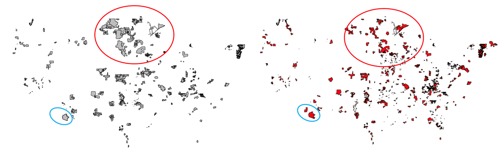
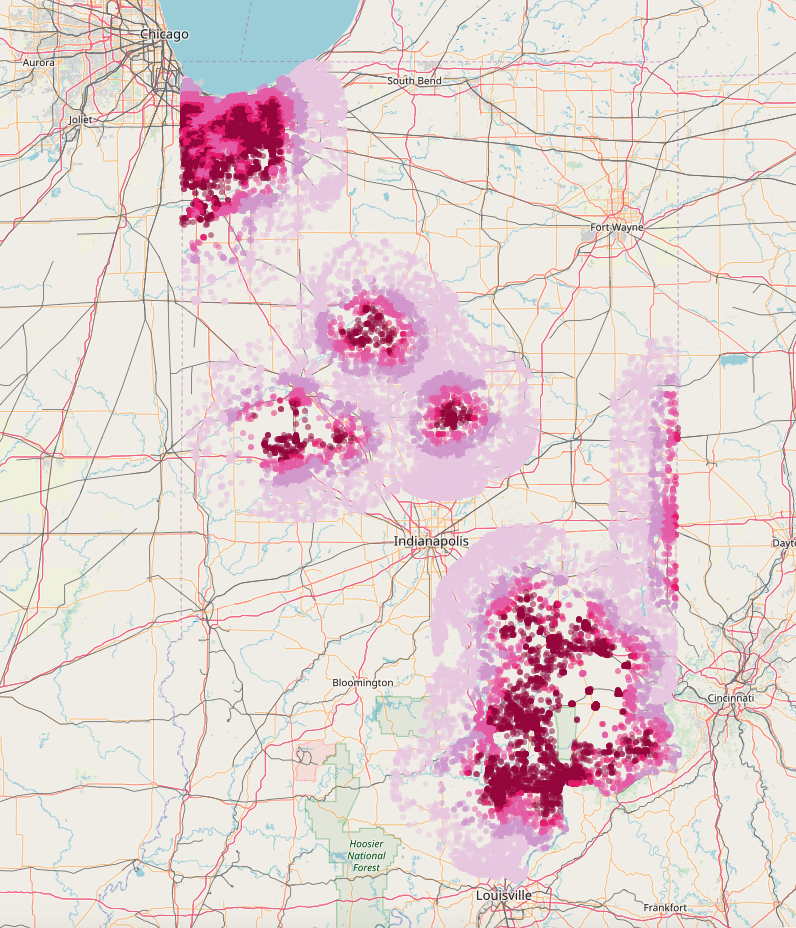

```{r}
#    word_document
```

 
```{r libraries, include=FALSE, message=FALSE, echo=FALSE}
knitr::opts_chunk$set(echo = FALSE, message = FALSE, error = FALSE, warning = FALSE)
# install.packages("dplyr")
library(dplyr)
library(ggplot2)
library(purrr)
library(sf)  
library(venn)
library(ggthemes)
```

```{r functions}

check_calc <- function(vec) {
  blanks <- 0L
  true_na <- 0L
  written_na <- 0L
  len <- length(x = vec)
  for (elem in vec) {
    if (is.na(x = elem)) {
      true_na <- true_na + 1L
    } else if (elem == "na") {
      written_na <- written_na + 1L
    } else if (elem == "") {
      blanks <- blanks + 1L
    }
  }
  percent_complete <- (len - (blanks + true_na + written_na)) / len
  unique_values <- length(unique(vec))
  tibble(blanks = blanks,
         true_na = true_na,
         written_na = written_na,
         percent_complete = percent_complete,
         unique_values = unique_values)
}
check_complete <- function(df) {
  z <- deparse(substitute(df))
  map_df(.x = df, .f = check_calc) %>%
    mutate(column = colnames(df)) %>%
    mutate(set = print(z))  %>%
    select(set, column, blanks, true_na, written_na, percent_complete, unique_values)
}
```


```{r loaddata, include=FALSE}
#"/project/biocomplexity/sdad/projects_data/project_data/usda/rural_broadband/working/BIP_working/BIP_Approved.RDS"
project_folder <- "/project/biocomplexity/sdad/projects_data/project_data/usda/rural_broadband/"

approved_dbf <- foreign::read.dbf(paste0(project_folder, "rus_broadband_servicearea/RD_BB_ApprovedSA.dbf"))
bip_approved <- readRDS(paste0(project_folder, "working/BIP_working/BIP_Approved.RDS"))

prot_borr_serv_area_sf <- st_read("/project/biocomplexity/sdad/projects_data/usda/bb/original/Protected_bb_borrower_service_areas/USDARD_ProtectedApproved02052020.dbf")

prot_borr_serv_area <- prot_borr_serv_area_sf %>% st_set_geometry(NULL) 

new_bip_approved_dbf <- foreign::read.dbf(paste0(project_folder, "RUS_BIP_Shapefiles_April2020/200409_BIP_ServAr_ID.dbf"))
new_bip_approved_sf <- sf::st_read(paste0(project_folder, "RUS_BIP_Shapefiles_April2020/200409_BIP_ServAr_ID.shp"))
new_masterfile <- readxl::read_excel(paste0(project_folder, "RUS_BIP_Shapefiles_April2020/200409_LinktoShapefile.xlsx"), sheet = 2)

# old_master_file <- read.csv(paste0(paste0(project_folder, "rus_broadband_servicearea/RUS_programs.csv")))
```

```{r}
join_new <- new_bip_approved_sf %>% left_join(new_masterfile, by = c("ProjectID", "RUS_ID" = "RUSID"))
join_new_df <- new_bip_approved_dbf %>% left_join(new_masterfile, by = c("ProjectID", "RUS_ID" = "RUSID"))

table(join_new_df$`Obligation Status`)
table(new_masterfile$`Obligation Status`)
table(is.na(new_masterfile$RUSID))

new_masterfile %>% count()

new_bip_approved_dbf %>% right_join(new_masterfile, by = c("ProjectID", "RUS_ID" = "RUSID"))
```


```{r plotsettings}
customPlot2 = list(
  theme(#plot.margin = unit(c(1,1,2,2), "cm"),
        axis.text.x  = element_text(vjust=0.5, size=12),
        plot.title=element_text(size=12, vjust=2),
        panel.grid.major = element_blank(), panel.grid.minor = element_blank(),
        panel.background = element_rect(fill = "#FFFFFF") , 
        legend.position="right"),  #coord_flip(), 
  guides(fill=guide_legend(title="Key", ncol = 1),
        colour =guide_legend(title="Key", ncol = 1))
)
```


***Abstract:*** 

The Economic Research Service (ERS) is an ***(independent?)*** statistical agency of the United States Department of Agriculture (USDA) primarily concerned with the landscape of the agricultural economy. Chief among its responsibilities is to ensure the well-being of rural economies by fostering economic development through a number of policy interventions. One such intervention took place in 2008, wherein the American Recovery and Restoration Act funded investments to furnish or expand broadband access and availability in rural areas. The goal of this paper is to describe a method by which local impacts of such investments can be measured via spatial mapping tools. The methods presented here allow for analysis of 

* add sentence about methods
* add sentence about results
* add 'what we learned' sentence


***

### Background

The US Department of Agriculture administers the Rural Utilities Service (RUS) as an operating unit of the Rural Development agency. RUS was initially created as the Rural Electrification Administration (REA) in 1935, when the New Deal established the group to furnish electric infrastructure across the country. Today, RUS serves rural communities by aiding the construction of basic infrastructure for 3 major utilities: water and environment, electric, and telecommunications. 

The federal government has a long history of investing in utilities and infrastructure, with broadband a more recent addition to their portfolio of programmatic mission areas. Some broadband funding and services represent one particular area of focus within USDA’s larger legislative priorities. 

* American Reinvestment and Recovery Act (2009)
* Farm Bill
* Rural Electrification Act
* Telecommunication Act
* Consolidated Appropriations Act

USDA’s telecommunications work seeks to furnish telecommunications services to rural communities with the goal of “improv[ing] educational opportunities, health care, safety and security and ultimately, higher employment.” # Facilitating broadband access and is a significant portion of their telecommunications efforts; and much of this work takes the form of various federal financial assistance offerings, such as loans, grants, and loan/grant hybrids.  Most recently, these efforts represented a $600 million investment via the 2019 ReConnect program.

The various pieces of legislation funding broadband investments at play have resulted in a pool of programs with varying histories, goals, and impacts. These are outlined below. 

*	Broadband Initiative Program (BIP) – 2009-2010
*	Rural Broadband Access Loan & Loan Guarantee Program
*	Community Connect (CC) – started in 2002
*	Distance Learning & Telemedicine (DLT) – 
*	Telecommunications Infrastructure Loans & Loan Gurantee
*	ReConnect - 2019


**BIP Eligibility Criteria & Definitions**

The Broadband Infrastructure Program (BIP) was authorized by the American Recovery and Reinvestment Act in 2009 and ran over two fiscal years, 2009-2010. Broadly, the program was enacted to help esetablish and improve access to high-speed, high-quality broadband access in rural areas, but saw some changes in its functional definitions and eligibility considerations. 

Policy Area | 2009 | 2010 | Other
-------|------------------|------------------|-------
Rurality| rural and remote areas | 75% rural|
Level of Service| unserved and underserved areas | 75% area without sufficient access|
Speed | 768 kbps downstream / 200 kbps upstream | no change |

*Rurality Definitions* The BIP eligibility requirements required areas to have a specific degree of rurality to qualify as eligible for the program. From 2009-2010, the BIP program shifted in focus from rural and remote areas to mostly rural areas. The 2009 BIP eligibility required applicants propose a potential service area in rural and remote areas, as defined by the decennial census. In 2010, BIP eligibility required applicants propose a potential service area in mostly rural areas. Specifically, 75% of the proposed area must qualify as a rural area. 

* Rural area: areas located outside cities containing fewer than 20,000 residents, and not adjacent to or contiguous with an urbanized area of over 50,000 residents.
* Remote area: rural area 50 miles from limits of non-rural area

*Level of Service*  Specific levels of broadband service were required to qualify as eligible for the BIP program, specifically aiming to serve rural areas without competitive access to broadband. From 2009-2010, The BIP program shifted in focus from unserved and underserved areas in 2009 to areas where 75% of the area is without sufficient access in 2010.

* Unserved area: an area where one or more contiguous census blocks where 90% or more households "lack access* to facilities-based, terrestrial broadband service, either fixed or mobile, at the minimum broadband transmission speed"
* Underserved area: area where one or more contiguous areas meet criteria that measure availability of broadband service and level of advertised broadband speed

*Speed* Broadband speed was another major criteria for BIP program eligibility, but this requirement did not change over the two years. The definition of broadband service was set as "two-way data transmission with advertised speeds of at least 768 kbps downstream and at least 200 kbps upstream to end user." 	

**BIP Sub-Programs**

Within BIP, there were also different programmatic interventions for consideration. Applicants in 2009 could specify whether they sought assistance in the form of grants or loans. In the case of grants, the eligibility requirements on level of service narrowed, as proposed areas had to be completely unserved. However,in the case of loans, the eligibility requirements expanded to include financial dimensions related to the debt the program represented that the applicant would be taking on. The following year, BIP specified different avenues for assistance to which the funding vehicles could be applied:

* Last Mile - projects that directly connect end-users, such as those in residential and business buildings, to broadband internet
* Middle Mile - projects (that do not serve end-users) that serve to build infrastructure facilitate connectivity between existing edge and core networks so as to improve or expand end-user broadband access served by an edge (local rural) network provider
* Satellite - projects to be served by satellite broadband providers
* Technical Assistance - funding to be applied to develop infrastructure by supporting planning of broadband implementations
* Rural Library Broadband - projects that serve libraries located in rural areas

SOURCE (https://www.sbc.senate.gov/public/_cache/files/9/a/9a25de47-c64e-42a5-b78d-74112a7aebc2/DB4D3BA6394B3D77577B991C32AF1C85.bip-grant-guide-round-2-la.pdf)

### Datasets

To study BIP impact on broadband access, a number of data were collected and provisioned. The RUS datasets were furnished over 2019 and describe various elements of broadband activities in RUS via 3 sets of shapefiles and 1 tabular file. There does not appear to be a way to join these files together. The last, tabular file (RUS bb projects_2009-2019) represents a masterfile of projects and their respective Borrowers. While its constituent variable BorrowerID appeared to link to one of the shapefiles (RD_BB_ApprovedSA file), a one-to-many relationship emerged (several project level detail files per Borrower ID in the shapefile), so we decided not to move forward with this file as there was no way to appropriately map the amounts to the areas. 

Based on the conversations at that point, we determined we would move forward with the first of the datasets, which we refer to as the Approved Service Areas, which we took to show approved service areas that most often belonged to the BIP program. 

Additionally, we investigated the utility of the Protected Broadband Borrowers Service Area Files, accessed online in 2020 from https://www.usda.gov/reconnect/eligibility-area-map-datasets. Upon investigation, it became evident that though this file appeared to show some similarities with the Approved Service Areas, this file was an incomplete version of the file received directly from RUS. The purpose of this file is to inform future broadband borrowers what areas are ineligible when proposing shapes for future broadband program applications. As such, this file represents a slice of ongoing projects and completed projects by current borrowers, as opposed to representing all areas that historically received broadband funding. These constraints resulted in a different subset of data that is posted online. This file was also considered for a possible analysis dataset. 


SOURCE | File Name | Type | Decision | Comments
-------|-----------|---------|--------|-----------------------------------------
RUS | RD_BB_ApprovedSA | shapefile | Considered & Selected | Maps RUS approved service areas
RUS | RD_BB_InfraBorrCLEC | shapefile |  | Maps Competitive Local Exchange Carriers with outstanding loans with RUS
RUS | RD_BB_InfrastructureBorr | shapefile | | Maps entities with outstanding loans with RUS
RUS | RUS bb projects_2009-2019 | tabular | | Project-level details, such as borrower, loan obligation, etc. 
USDA web | USDARD_ProtectedApproved02052020 | shapefile | Considered | Maps areas ineligible for future broadband project proposals

**Comparison of Approved Service Areas & Protected Borrowers Dataset **

Given the two possible datasets at hand, a comparison of the two datasets commenced. These two datasets differed fairly significantly, presenting a decision point of which dataset to use. 

*Mixed vs Discrete Program Treatment and Coverage* Programs treated discretely in Approved Service Areas file but appear in combination in the Protected Borrowers file. The Protected Borrowers file shows overlapping programs for a given shape. In the tables below, n represents the number of shapes with the particular combination of program assignments. Interestingly, Protected Borrowers shows BIP with the loan vs. grant support type, and these BIP supports appear in combination with Infrastructure, Telecom, Broadband, and Community Connect. On the other hand, the Approved Service Area file generally shows a single program for a given shape but does not distinguish between loans and grants. Lastly, the count of shapefiles per program does not align between the two datasets, even accounting for overlapping shapes. See Appendix for tables. 


Protected Borrowers

```{r}
compareprograms_protborr <- prot_borr_serv_area %>% 
  count(PROGRAM, SUBPROGRAM, INF, BB, BIPLOAN, BIPGRANT, CCGRANT) %>% 
  mutate(BIP = ifelse(stringr::str_detect(PROGRAM, "BIP") |!is.na(BIPLOAN) |!is.na(BIPGRANT), "BIP", "Non-BIP"))

ggplot(compareprograms_protborr, aes(x = PROGRAM, y = sum(n))) +
  geom_bar(stat = "identity", fill = "#C4C6C1") +
  facet_wrap(~BIP)+
  coord_flip() +
  customPlot2 +
  labs(title = "Protected Borrowers - Programs", 
       caption = "Programs as listed in Protected Borrowers file do not neatly align. For example, shapes associated with BIP program or BIP funding include shapes also associated Telecommunications funding, but Telecommunications funding is also seen with Non-BIP shapes.")

# ggplot(compareprograms_protborr %>% filter(BIP == "Non-BIP"), aes(x = SUBPROGRAM, y = sum(n),fill = PROGRAM)) +
#   geom_bar(stat = "identity") +
#   coord_flip() +
#   customPlot2 +
#   labs(title = "Protected Borrowers - Programs", 
#        caption = "Programs as listed in Protected Borrowers file do not neatly align.")
```

Approved Service Areas

```{r}
compareprograms_approvedbip <- approved_dbf %>% count(BIP = ifelse(stringr::str_detect(PROGRAMTYP, "BIP"), "BIP", "NON-BIP"), PROGRAMTYP, PROGRAMSER)

ggplot(compareprograms_approvedbip, aes(x = PROGRAMTYP, y = sum(n))) +
  geom_bar(stat = "identity", fill = "#bd3636") + ##bd3636 #ba1010
  facet_wrap(~BIP)+
  coord_flip() +
  customPlot2 +
  labs(title = "Approved Service Areas - Programs", 
       caption = "Programs as listed in Approved Service Areas dataset neatly align. For example, shapes associated with BIP program do not overlap with other shape's associated programs.")
```


*Project Coverage* The projects represented in the two datasets showed some, but not complete overlap. The Protected Borrowers file shared 192 projects overall in common with the Approved Service Areas file. 

```{r}
approvedsa_projects  <- unique(approved_dbf$RUS_ID)
protborr_projects  <- c(as.character(prot_borr_serv_area$RUSID_1), as.character(prot_borr_serv_area$RUSID_2), as.character(prot_borr_serv_area$RUSID_3))
protborr_projects <- protborr_projects[!is.na(protborr_projects)]
venn(x = list(protborr_projects, approvedsa_projects), snames = c("Protected Borrowers", "Approved Service Areas"), zcolor = c("#C4C6C1", "#bd3636"))  #ba1010#"grey, red")
 
##bd3636 #ba1010
```

*Project Status* The projects represented in the two datasets showed minor differences in approval statuses. The Protected Borrowers file shows all projects in approved status, but the Approved Service Areas file shows projects in varying approval stages. The graph below uses variable APPSTATUS from both files; however Approved Service Area
    
```{r}

comparestatus <- rbind(approved_dbf %>% count(APPSTATUS = APPSTATUSS) %>% mutate(dataset = "Approved SA"), prot_borr_serv_area %>% count(APPSTATUS) %>% mutate(dataset = "Protected Borr")) %>% mutate(column = "APPSTATUS")

# comparestatus <- rbind(comparestatus, approved_dbf %>% count(APPSTATUS = STATUS) %>% mutate(column = "APPSTATUS", dataset = "Approved SA"))

ggplot(data = comparestatus, aes(x = APPSTATUS, y = n, fill = dataset)) + 
  geom_bar(stat = "identity", position = position_dodge(preserve = "single")) +
  geom_text(aes(label = n, y = ifelse(n <20, n +2, n + 200)), position = position_dodge(width = 1)) +
  customPlot2 +
  scale_fill_manual(values = c("#bd3636", "#C4C6C1")) +
  scale_y_continuous(trans = "log10") +
  labs(title = "Comparing Approved Service Areas & Protected Borrowers - Status", 
       caption = "All projects in protected borrowers are approved, while approved service areas show varying statuses.")

```
    
*Project Geographies* The projects represented in the two datasets showed major differences the shapes themselves. The maps below show the subset of the files representing BIP shapes, with Protected Borrowers in grey at left and Approved Service Areas in red at right. 

* RED CIRCLE – Some shapes present or at least overlap in both sets, but some shapes are missing in Original RUS file. *Note coverage in northern region of Midwest on Borrowers on left, but how different this region looks in RUS on right.*
* BLUE CIRCLE – Some shapes present or at least appear to overlap in both sets, but some shapes are missing in Borrowers file. *Note southwest US has a portion of the larger shape in Borrowers on left, but missing some of that shape and its neighbor shape in RUS on right.*
    
LEFT in gray - Protected Borrowers Map
RIGHT in red - Approved SA Map
 
 

Program |Protected Borrower Service Areas | Approved Service Areas
--------|-----------------------|-----------------------
ReConnect | 356 | 0 
BIP | 588 | 1366
CC | 196 | 80
Farm Bill | 24 | 95 
Telecom | 90 | 15
Infrastructure | 3 |
None | 620 |


***

```{r eval = F}
sample <- character()
for (i in colnames(approved_dbf)) {
  sample[i] <- as.character(approved_dbf[1,i])
}

tibble(Columns = colnames(approved_dbf), 
       Sample = sample) %>% 
  knitr::kable()

```

##### BIP SHAPEFILE DATA

Variables of interest:

* RUS ID: Service Area identifier
* Published Date: Date associated with service area 
* Status: Approval status of RUS service area
* Applicatin Status: Application Approval Status
* Program Type: Program 
* Program Service: Sub-program 
* Company: Program applicant

```{r}
bgt_resume_complete <- check_complete(approved_dbf)
bgt_resume_complete %>% mutate(percent_complete = scales::percent(percent_complete)) %>% knitr::kable()
```

```{r}
ggplot(data = bgt_resume_complete, 
       aes(x = reorder(column, percent_complete), y = percent_complete*100)) +
  geom_bar(stat = "identity") +
  coord_flip()
```


*RUS ID*
```{r eval = F}
tibble("Total Rows" = nrow(approved_dbf),
       "Unique Identifier Ct" = length(unique(approved_dbf$RUS_ID))) %>% knitr::kable()
```

Identifiers repeat in this dataset, (mostly?) because it's a spatial dataset. Just under half of the service areas only  require a single shape, but just over half require more than 1 shape, up to 500 for some projects. 

```{r}
identifier_spread <- approved_dbf %>% count(RUS_ID) 

#table(identifier_spread$n > 1) %>% knitr::kable()

ggplot(data = identifier_spread, aes(x = as.factor(n))) + 
  geom_histogram(stat = "count") 
```

*Published Date*

The dates associated with the service area span 1985-2015, with the majority of service area shapes falling on April 22, 2010 and a significant portion of blank dates. 

```{r eval = F}
tibble("Total Rows" = nrow(approved_dbf),
       "Unique Identifier Ct" = length(unique(approved_dbf$PUBLISHEDD))) %>% knitr::kable()
```


```{r}

ggplot(data = approved_dbf, aes(x = as.factor(lubridate::as_date(PUBLISHEDD)))) + 
  geom_histogram(stat = "count") +
  coord_flip()
```


*Status*

```{r}
ggplot(data = approved_dbf, aes(x = STATUS)) + 
  geom_histogram(stat = "count") + coord_flip()
```


```{r}
ggplot(data = approved_dbf, aes(x = APPSTATUSS)) + 
  geom_histogram(stat = "count") +
  coord_flip()
```

*Program*

```{r}
ggplot(data = approved_dbf, aes(x = PROGRAMTYP)) + 
  geom_histogram(stat = "count") + coord_flip()

ggplot(data = approved_dbf, aes(x = PROGRAMSER)) + 
  geom_histogram(stat = "count") + coord_flip()

```

*Company*

```{r}
top10companies_by_shapes <- approved_dbf %>% count(COMPANY) %>% arrange(desc(n)) %>% head(10)
top10companies_by_rusid <- approved_dbf %>% count(COMPANY, RUS_ID) %>% select(-n) %>% count(COMPANY) %>% arrange(desc(n)) %>% head(10)

ggplot(data = top10companies_by_shapes, aes(x = reorder(COMPANY, n), y = n)) + 
  geom_histogram(stat = "identity") + coord_flip()

ggplot(data = top10companies_by_rusid, aes(x = reorder(COMPANY, n), y = n)) + 
  geom_histogram(stat = "identity") + coord_flip()
```

In our set, we limited the original data by requiring the following filters: 

* Status - Approved
* Application Status - Approved
* Program Type - contains string “BIP” (includes two programs under BIP: Middle Mile & Last Mile)
* Published - year is 2010

This limits our set from `r nrow(approved_dbf) `to `r nrow(bip_approved)`, a difference of `r  nrow(approved_dbf) - nrow(bip_approved)` shapefiles. In limiting the set in this way, `r length(unique(approved_dbf$RUS_ID)) - length(unique(bip_approved$RUS_ID)) ` RUS IDs are removed from the original set of  `length(unique(approved_dbf$RUS_ID)) ` RUS IDs. 

New BIP set geography looks like this: 

```{r}
usa <- st_as_sf(maps::map("state", fill=TRUE, plot =FALSE))

usmap <- ggplot(data = usa) +
  geom_sf()

usmap + 
  geom_sf(data = bip_approved)

```


METHODS


DONUT METHOD

Indiana set: 

* Only 7 houses don’t seem to have any fcc values – these 7 seemed to exist in the 2010 geographies, but not in the 2000 geographies for some reason
* At the 786 speed definition there are no houses without coverage ☹
* You only start to see houses with NO coverage at the 3 mbps speed (400 houses out of 60,611)
* The max houses without coverage happens at 25 mbps (2914 houses out of 60,611)

Indiana | # Houses Inside | # Houses Outside
--------|-----------------|-----------------
Total IN Houses | 380,510 | 0
Total BIP IN Houses | 24,775 | 255,735
1 mile BIP buffer area | 42,030 | 338,480
5 mile BIP buffer area | 72,950 | 307,560
10 mile buffer area | 90,757 | 289,753
25 mile buffer area | 169,110 | 211,400

Distances

* 5 miles – hot pink
* 10 miles -  regular pink  
* 25 miles –  lavender purple
* 50 miles – pastel lilac/pink


 

CENSUS BLOCK METHOD

Centroids of 2010 census blocks
Distance to nearest BIP region (in state or neighboring states)
NBM 2011 # Providers at 200 kbps speed and 3 mbps speed
FCC 2016 # Providers at 200 kbps speed and 3 mbps speed
 
I’m doing this right now for the 8 largest states (CA, CO, FL, GA, NC, OH, PA, TX)  and then looking to join in the CoreLogic data. Can you remind me, were you looking to have summary data per census block or the above data per house? In other words, should the data look like:
 
House level
Census block level
Each row is a house
Each house has block-level information about nearest BIP and bb availability
 
Example:
This house specifically sold for $100,000 and it is in this census block, which shows 1 provider at 200 kbps in 2011 and 5 in 2016.
Each row is a census block
Each block has summary information about the houses sold in that block
 
Example:
This block shows 2 provider in 2011 and 5 in 2016. This block contains 14 house sales: 10 1-Bedroom houses and 4 2-bedroom houses.
 


```{r eval = FALSE}
joinfold <- "/project/biocomplexity/sdad/projects_data/project_data/usda/rural_broadband/working/state_blocks_centroids_bipdist_2011_16/"
completedbip_fcc_blockjoins <- list.files(joinfold)
completedbip_fcc_blockjoins <- paste0(joinfold, completedbip_fcc_blockjoins)

datapath <- "/project/biocomplexity/sdad/projects_data/usda/bb/"
borders <- read.csv(paste0(datapath, "original/stateborder.csv")) %>% select(2:3)

datapath2 <- "/project/biocomplexity/sdad/projects_data/project_data/usda/rural_broadband/"
usa_bip_shapes <- readRDS(paste0(datapath2, "working/BIP_working/BIP_Approved.RDS"))

###### ALABAMA
abbrev <- "IN"
indiana <- readRDS(completedbip_fcc_blockjoins[18])
indiana_500mpoints <- alabama[alabama$bip_dist < 500 & alabama$bip_dist > 0,  ]
indiana_outline <- tigris::counties(abbrev) %>% st_as_sf() %>% st_transform(st_crs(usa_bip_shapes))

alabama_neighbors <- borders %>% filter(ST1 == abbrev | ST2 == abbrev) %>% mutate(neighbors = ifelse(ST1 == abbrev, as.character(ST2), as.character(ST1)))
alabama_neighbors <- c(alabama_neighbors$neighbors, abbrev)
alabama_nearest_bips <- usa_bip_shapes[usa_bip_shapes$STUSPS %in% alabama_neighbors,]

plot(alabama_outline$geometry)
plot(alabama_nearest_bips$geometry, add = TRUE, col = "red")
plot(alabama_500mpoints$geometry, add = TRUE, col = "blue", pch = 15)
```


```{r}
# st_as_sf(maps::map("state", fill=TRUE, plot =FALSE))
# 
# ??maps::map()
# maps::county.fips %>% filter(stringr::str_detect(fips, "^18"))
```


***


***Outline***

I.  Introduction  - GOAL - end of MARCH 
    A.  Background on USDA > RUS
    B.  Background on Broadband Infrastructure Program
        1. Definition of broadband
    C.  Motivation & Approach (Methods overview)
    D.  CASE STUDY: INDIANA
II.  Data Sources *including EDA for each dataset*  - GOAL - end of MARCH 
    A.  Spatial data
        1.  Census tracts/blocks
        2.  Custom shapes
    B.  CoreLogic
        1.  Tax Assessments
        2.  Deeds  
    C.  FCC ***(does this bear mentioning?)***
    D.  BIP shape data
III.  Methods - GOAL - end of FEBRUARY
    A.  Data Preparation
    B.  Spatial Manipulations
    C.  Modeling Techniques
    D.  Paralellization - depending
IV.  Results - GOAL - end of FEBRUARY
    A.  Descriptive results only? 
    B   Also modeling results? 
V.  Discussion - GOAL - end of MARCH 
    A.  Conclusions 
    B.  Challenges/Limitations
    C.  Future Opportunities
VI.  Bibliography
VII.  Data Citations
VIII.  Appendix


Supplementary materials - on website - future discussion
* aggregate data
* code 

***

APPENDIX

TABLE 1 - Combined programs from protected borrowers

```{r}
prot_borr_serv_area %>% count(PROGRAM, SUBPROGRAM, INF, BB, BIPLOAN, BIPGRANT, CCGRANT) %>% arrange(PROGRAM, SUBPROGRAM, BIPLOAN, BIPGRANT) %>% knitr::kable()
```

TABLE 2 - 1:1 programs from approved SA


```{r}
approved_dbf %>% count(PROGRAMTYP, PROGRAMSER) %>% knitr::kable()
```

***
***
***


## NEW DATASET

**Q. How complete is the data? **
A. Basically 87% if we remove nulls?  
```{r}
check_complete(join_new_df) %>% knitr::kable()
```


```{r, eval = FALSE}
usmap + 
  geom_sf(data = join_new, aes(fill = PROGRAMTYP))
```

```{r , eval = FALSE}
colnames(join_new_df)
head(join_new_df)
```

**Q. How clean is the program information? **
A. Cleaner than last year's data, cleaner than protected borrowers

```{r}
ggplot(join_new_df, aes(PROGRAMTYP, fill =  ProjectTypeID)) + 
  geom_bar(stat = "count", position = position_dodge()) 
  # geom_text(stat = ..count.., aes( y = ifelse(n <20, n +2, n + 200)), position = position_dodge(width = 1)) 
```

**Q. Who are the top 10 companies? **
A. By number of shapes

```{r}
top10companies_NEW_bynumshapes <- join_new_df %>% count(COMPANY) %>% arrange(desc(n)) %>% head(10)

ggplot(top10companies_NEW_bynumshapes, aes(reorder(COMPANY, n), n)) + 
  geom_bar(stat = "identity") + coord_flip()
```

A. By area, as defined by their area variable (not our own calculations)

```{r}
top10companies_NEW_byarea <- join_new_df %>% group_by(COMPANY) %>% summarise(total_area = sum(`Shape__Are`)) %>% arrange(desc(total_area)) %>% head(10)

ggplot(top10companies_NEW_byarea, aes(reorder(COMPANY, total_area), total_area)) + 
  geom_bar(stat = "identity") + coord_flip()
```

A. By dollars of original obligation

```{r}
top10companies_NEW_bydollars <- join_new_df %>% group_by(COMPANY) %>% summarise(orig_obl = sum(`Original Obligation`)) %>% arrange(desc(orig_obl)) %>% head(10)

top10companies_NEW_bydollars %>% mutate(orig_obl = scales::comma(orig_obl)) %>% knitr::kable()

```

**Q. What is the status of the projects described by this data? **
A. Most appear to have received money (past application approval, past project approval, into project start?)

```{r}
ggplot(join_new_df, aes(`Obligation Status`)) +
  geom_bar(stat = "count")
```

However some projects had money rescinded... 

```{r}
ggplot(join_new_df, aes(is.na(`Rescinded Amount`))) +
  geom_bar(stat = "count")

```

**Q. Can we uniquely identify projects and their shpaes?**
A. As before, every shape has a RUS ID and now most of the projects have linkable constituent shapes.

```{r}
ggplot(join_new_df, aes(is.na(`RUS_ID`), fill = is.na(ProjectID))) +
  geom_bar(stat = "count")
```

A. Discrepancies in Project/Borrower shapefile availability probably explain this, i.e., maybe they just don't have it. 

```{r}
ggplot(join_new_df, aes(`Has Project Shapefile`, fill = `Has Borrower Shapefile`)) +
  geom_bar(stat = "count")
```

**Q. What do maps look like?**


```{r}
hawaii_shapes <- join_new %>% filter(stringr::str_detect(RUS_ID, "^HI"))
alaska_shapes <- join_new %>% filter(stringr::str_detect(RUS_ID, "^AK"))
cont_us_shapes <- join_new %>% filter(RUS_ID %in% hawaii_shapes$RUS_ID == FALSE) %>% filter(RUS_ID %in% alaska_shapes$RUSID == FALSE) %>%
  filter(stringr::str_detect(RUS_ID, "^(AS|GA)") == FALSE)
```


```{r ,eval = FALSE}
library(ggthemes)
devtools::install_github("wmurphyrd/fiftystater")
library(fiftystater)
usmap

basemap <- ggplot() + geom_polygon( data=fifty_states, aes(x=long, y=lat, group = group),color="grey10", fill="white" )

basemap + geom_sf(data = cont_us_shapes, aes(fill = PROGRAMTYP))

table(stringr::str_extract(cont_us_shapes$RUSID, ".{0,2}"))
```


```{r}
# Plot: ANY OVERLAP [min10, max200] -------------------------------------------------------------------------------------
#

# Plot contiguous states
plot_main <- ggplot() +
  geom_sf(data = cont_us_shapes, aes(fill = `ProjectTypeID`)) +
  theme_map() +
  coord_sf(crs = st_crs(2163), xlim = c(-2500000, 2500000), ylim = c(-2300000, 730000)) +
  # labs(title = "Tract-Level ACS and FCC Broadband Subscription Estimate\nInterval Congruence [min10mbps, max200kbps]", 
  #      subtitle = "Tracts with incongruent estimate ranges shown in grey (NA).",
  #      caption = "Note: FCC = Federal Communications Commission, December 2016. ACS = American Community Survey, 2014-18.\nAlaska and Hawaii not to scale.") +
  # scale_fill_manual(name = "Urbanicity", values = c("#fed98e", "#fe9929", "#d95f0e", "#993404"), na.value = "#f0f0f0") +
  theme(plot.title = element_text(size = 16, face = "bold"),
        legend.title = element_text(size = 10, face = "bold"),
        legend.text = element_text(size = 10),
        legend.position = "top")

# Plot Hawaii
plot_hawaii <- ggplot() +
  geom_sf(data = hawaii_shapes, aes(fill = `ProjectTypeID`))  +
  theme_map() +
  coord_sf(crs = st_crs(4135), xlim = c(-161, -154), ylim = c(18, 23), expand = FALSE) +
  # scale_fill_manual(name = "Urbanicity", values = c("#fed98e", "#fe9929", "#d95f0e", "#993404"), na.value = "#f0f0f0") +
  theme(legend.position = "none")

# Plot Alaska
plot_alaska <- ggplot() +
  geom_sf(data = alaska_shapes, aes(fill = `ProjectTypeID`)) +
  theme_map() +
  coord_sf(crs = st_crs(3467), xlim = c(-2400000, 1600000), ylim = c(200000, 2500000), expand = FALSE) +
  # scale_fill_manual(name = "Urbanicity", values = c("#fed98e", "#fe9929", "#d95f0e", "#993404"), na.value = "#f0f0f0") +
  theme(legend.position = "none")

# Plot all
plot_min10max200 <- plot_main +
  annotation_custom(grob = ggplotGrob(plot_alaska),
                    xmin = -3350000,
                    xmax = -3350000 + (1600000 - (-2400000))/1.8,
                    ymin = -2450000,
                    ymax = -2450000 + (2500000 - 200000)/1.8) +
  annotation_custom(grob = ggplotGrob(plot_hawaii),
                    xmin = -1700000,
                    xmax = -1700000 + (-154 - (-161))*230000,
                    ymin = -2450000,
                    ymax = -2450000 + (23 - 18)*230000)
```

```{r}
plot_min10max200
```

```{r}
# Plot: ANY OVERLAP [min10, max200] -------------------------------------------------------------------------------------
#

# Plot contiguous states
plot_main <- ggplot() +
  geom_sf(data = cont_us_shapes, aes(fill = `Original Obligation`/1000)) +
  theme_map() +
  coord_sf(crs = st_crs(2163), xlim = c(-2500000, 2500000), ylim = c(-2300000, 730000)) +
  # labs(title = "Tract-Level ACS and FCC Broadband Subscription Estimate\nInterval Congruence [min10mbps, max200kbps]", 
  #      subtitle = "Tracts with incongruent estimate ranges shown in grey (NA).",
  #      caption = "Note: FCC = Federal Communications Commission, December 2016. ACS = American Community Survey, 2014-18.\nAlaska and Hawaii not to scale.") +
  # scale_fill_manual(name = "Urbanicity", values = c("#fed98e", "#fe9929", "#d95f0e", "#993404"), na.value = "#f0f0f0") +
  theme(plot.title = element_text(size = 16, face = "bold"),
        legend.title = element_text(size = 10, face = "bold"),
        legend.text = element_text(size = 10),
        legend.position = "right")

# Plot Hawaii
plot_hawaii <- ggplot() +
  geom_sf(data = hawaii_shapes, aes(fill = `Original Obligation`/1000))  +
  theme_map() +
  coord_sf(crs = st_crs(4135), xlim = c(-161, -154), ylim = c(18, 23), expand = FALSE) +
  # scale_fill_manual(name = "Urbanicity", values = c("#fed98e", "#fe9929", "#d95f0e", "#993404"), na.value = "#f0f0f0") +
  theme(legend.position = "none")

# Plot Alaska
plot_alaska <- ggplot() +
  geom_sf(data = alaska_shapes, aes(fill = `Original Obligation`/1000)) +
  theme_map() +
  coord_sf(crs = st_crs(3467), xlim = c(-2400000, 1600000), ylim = c(200000, 2500000), expand = FALSE) +
  # scale_fill_manual(name = "Urbanicity", values = c("#fed98e", "#fe9929", "#d95f0e", "#993404"), na.value = "#f0f0f0") +
  theme(legend.position = "none")

# Plot all
plot_min10max200 <- plot_main +
  annotation_custom(grob = ggplotGrob(plot_alaska),
                    xmin = -3350000,
                    xmax = -3350000 + (1600000 - (-2400000))/1.8,
                    ymin = -2450000,
                    ymax = -2450000 + (2500000 - 200000)/1.8) +
  annotation_custom(grob = ggplotGrob(plot_hawaii),
                    xmin = -1700000,
                    xmax = -1700000 + (-154 - (-161))*230000,
                    ymin = -2450000,
                    ymax = -2450000 + (23 - 18)*230000)
```

```{r}
plot_min10max200
```


